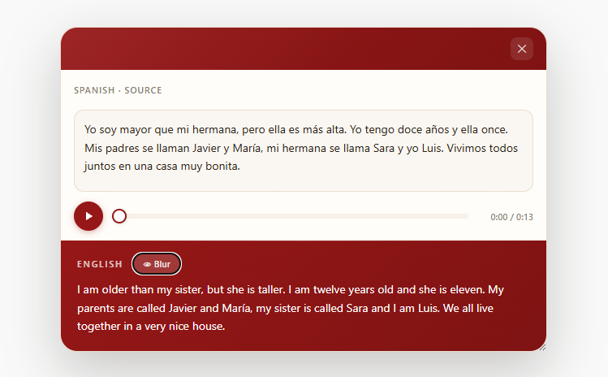

# Spanish Live Translation Extension

A premium Chrome Extension that provides instant Spanish → English translation via a floating panel with audio playback.



## Features

- **Live Translation** — Highlight Spanish text, right-click, and select **🌐 Live Translation** to see the English translation instantly.
- **Auto-Update** — Once the panel is open, highlighting new text updates the translation automatically — no need to right-click again.
- **Audio Playback** — Listen to the Spanish source text with a visual progress bar. Settings (speed, volume, autoplay) are configurable from the extension popup.
- **Dynamic Theme** — Customize the extension's accent color in the popup settings. Gradients and UI elements automatically adapt!
- **Blur Toggle** — Hide the English translation for self-testing.
- **Shadow DOM Isolation** — Panel styles are fully isolated from the host page via Shadow DOM.
- **Draggable UI & Auto-Resize** — Drag the panel via the top banner. The window intelligently resizes based on the size of the translation!

## Installation and How to Use

1. Download or clone this repository.
2. Open Chrome (or any Chromium browser) and go to `chrome://extensions/`.
3. Enable **Developer mode** in the top-right corner.
4. Click **Load unpacked** and select this folder.
5. Highlight any **Spanish text** on a web page.
6. Right-click and select **🌐 Live Translation**.
7. Translation appears instantly — listen with audio playback.

## Project Structure

```
├── manifest.json     # Extension manifest (MV3)
├── background.js     # Service worker — context menu & translation API
├── content.js        # Content script — panel UI, speech, selection listener
├── panel.css         # Panel styles (injected into Shadow DOM)
├── popup.html        # Extension popup — usage instructions
├── popup.css         # Popup styles
├── popup.js          # Popup script — settings sync & version display
├── README.md         # This file
└── LICENSE           # MIT License
```


## License

Licensed under the [MIT License](LICENSE).
